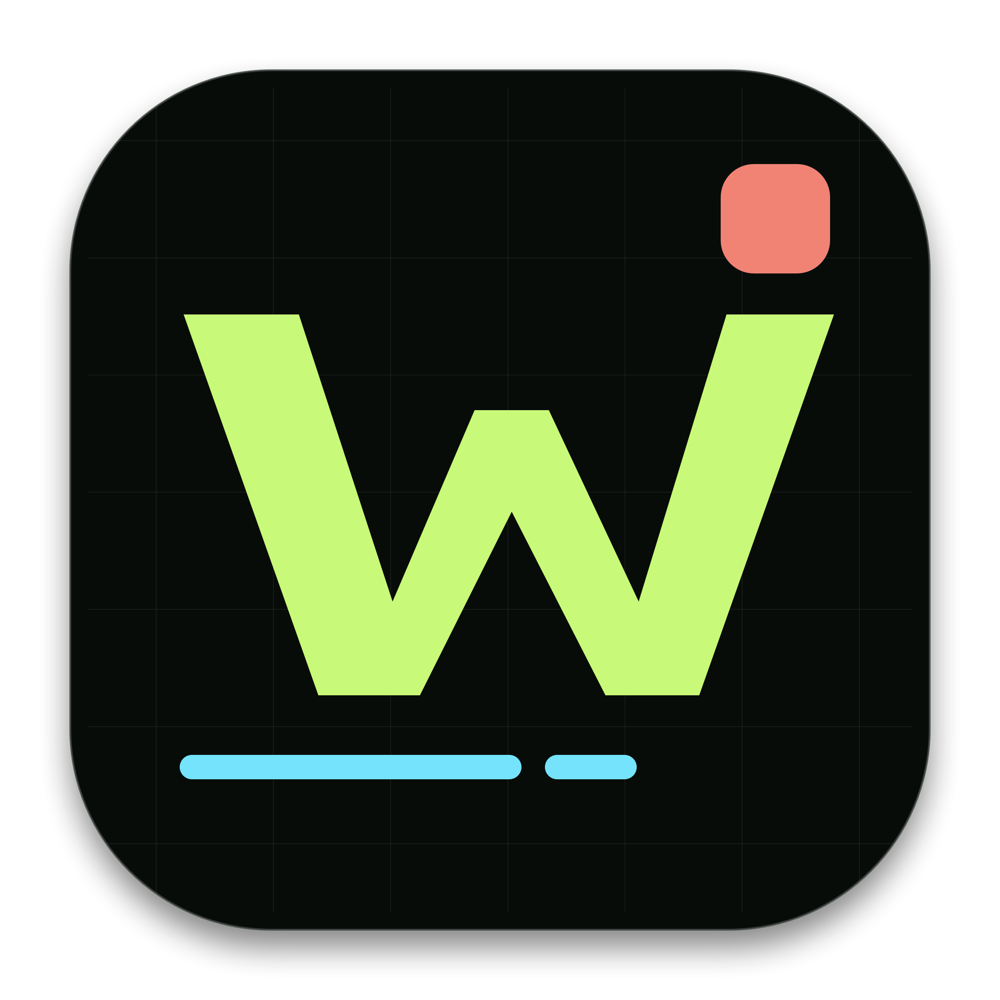

# Workbench

面向个人开发工作流的 macOS 原生控制台。Workbench 使用 SwiftUI + AppKit 构建，数据完全保存在本机，不依赖服务端或第三方运行时。



## 设计方向

- 高对比画布，默认深色，支持「深色 / 浅色 / 跟随系统」三模式切换（顶部栏右侧分段控件，选择持久化）；使用荧光绿、珊瑚红、电光青和信号黄区分功能语义。
- 稳定侧边栏与 `Command + 1...5` 工作区快捷键，`Command + K` 可打开全局命令面板。
- 8px 以内圆角、精确分隔线与高密度信息排版，适合长时间使用。
- Premium 动效节奏，并自动尊重 macOS 的“减少动态效果”设置。

## 功能

### 概览

聚合应用数量、CPU、内存、保险库状态、常用与最近启动应用。系统采样在工作区间共享，切换页面不会重置趋势。

### 启动台

- 创建、重命名和删除应用分组。
- 批量选择或拖入 `.app`，自动拦截重复记录。
- 搜索、排序、收藏、最近启动次数与路径失效提示。
- 应用移动后可根据 Bundle ID 自动修复路径，也可在 Finder 中定位。

### 系统脉搏

- CPU 综合与逐核心采样、60 点趋势图、内存与磁盘状态。
- 自动刷新暂停、1/2/5/10 秒刷新间隔与手动刷新。
- 按 CPU 排序的稳定进程表，支持筛选、选择、复制 PID 和精确 PID 查询。
- `ps` 在后台执行，避免采样阻塞 SwiftUI 主线程。

### 密钥保险库

- PBKDF2-HMAC-SHA256 派生密钥，AES-GCM 加密与认证，明文不落盘。
- 新建主密码二次确认，支持条目新增、编辑、删除、搜索、分类和收藏。
- 单字段显示/隐藏、强密码生成和复制成功反馈。
- 敏感剪贴板 45 秒后自动清理，十分钟无敏感操作自动锁定。
- 支持更换主密码与导出单文件加密备份。
- 旧版 `meta.json + data.enc` 会在首次成功解锁后迁移为版本化单文件信封，旧文件保留作为回退。

### 文件与终端

- Spotlight 文件名搜索，350ms 去抖并隔离并发请求，旧结果不会覆盖新查询。
- 结构化展示文件类型、大小、修改时间与完整路径，支持打开、Finder 定位和复制路径。
- 命令执行器保留工作目录，支持 `cd`、`cd -`、会话历史、退出码与耗时。
- stdout/stderr 并发排空并限制保留量，大输出不会因 Pipe 写满而死锁。

### 工具

- **编解码与换算 DevCalc**：Base64（含 URL-safe）、URL 编解码、MD5/SHA1/SHA256 哈希、JWT 三段解析与美化、时间戳（秒/毫秒）↔ 本地/UTC/ISO8601、JSON 格式化/压缩/校验、字节容量与进制换算。
- **端口与进程管家 PortPilot**：`lsof` 解析全部监听端口（TCP/UDP），展示 PID、进程与对应 App 图标；服务总览按 App 聚合卡片；一键 kill、复制 PID、端口冲突标记，支持搜索与自动刷新。
- **剪贴板历史**：轮询系统剪贴板记录文本与文件，支持搜索、类型过滤、固定常用项、点击回贴、删除与清空，本地持久化。

## 构建与安装

要求 Apple Silicon Mac、macOS 14 或更高版本，以及包含 Swift 6 工具链的 Xcode。

```bash
cd /Users/xuyu/personal/dashboard
bash build.sh --install
```

构建脚本会依次生成全尺寸应用图标、编译 Release、创建 ad-hoc 签名的 `dist/Workbench.app`，并安装到：

```text
/Applications/Workbench.app
```

只生成本地产物而不安装：

```bash
bash build.sh
```

## 本地数据

Workbench 数据位于：

```text
~/Library/Application Support/Workbench/
├── launcher.json
├── launcher.backup.json
└── secrets/
    ├── vault.enc.json
    └── vault.backup.enc.json
```

启动台与保险库均使用原子写入，并在覆盖前保留最近一次备份。保险库主密码无法找回，请将其保存在独立且可信的位置。

## 项目结构

```text
Sources/Workbench/
├── main.swift            # AppKit 生命周期与主窗口
├── ContentView.swift     # 全局侧边栏、工作区与命令面板
├── DesignSystem.swift    # 视觉令牌与共用组件
├── Overview.swift        # 全局概览
├── Launcher.swift        # 应用启动台
├── Monitor.swift         # 系统资源与进程监控
├── Secrets.swift         # 本地加密保险库
├── FilesTerminal.swift   # 文件搜索与命令执行器
├── Models.swift          # 兼容迁移的数据模型
├── Storage.swift         # 原子持久化与备份
└── Shell.swift           # 有界、安全排空的进程执行

Tools/GenerateAppIcon.swift
Resources/AppIcon-1024.png
build.sh
```

## 分发给朋友（免开发者账号）

当前 `build.sh` 使用 **ad-hoc 签名**（无开发者证书、未做苹果公证）。因此它**无法**直接发给别人双击安装——macOS 的 Gatekeeper 会拦截并提示「无法验证开发者」。

若只是给信任你的朋友使用，请走以下流程：

1. 在本机生成可分发包：

   ```bash
   cd /Users/xuyu/personal/dashboard
   bash build.sh
   ```

   产物为 `dist/Workbench-macos.zip`（已用 `ditto` 打包，保留 `.app` 结构）。把它发给朋友即可。

2. 朋友收到后，解压得到 `Workbench.app`，在终端执行一次：

   ```bash
   xattr -dr com.apple.quarantine /路径/Workbench.app
   ```

3. 在访达中**右键** `Workbench.app` →「打开」→ 在弹窗中点「仍要打开」。

   若仍被系统拦截，前往「系统设置 → 隐私与安全性」，底部会出现「Workbench 已被拦截」提示，点击「仍要打开」即可。

> 这套流程依赖朋友对你本人的信任。若要**公开/不特定分发、实现双击即装**，需要注册 Apple Developer Program（¥688/年），用 `Developer ID Application` 证书签名并对 app 做苹果公证。届时可在 `build.sh` 中接入 `xcrun notarytool` 自动公证流程。
